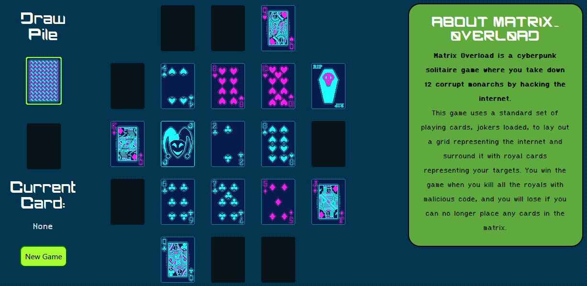

## Table of Contents
- [Description](#description)
- [Limitations](#limitations)
- [Lessons Learned](#lessons-learned)

## Description
In this collaborative project [Simon G.](https://github.com/Simon-G1) and I have created a card game using HTML5, CSS3, Javascript and jQuery.  
[The game can be played by clicking this link or the banner.](https://khyleb.github.io/MATR1X_0VERL0AD/)
  
The goal of this project was to become familiar with Javascript & associated libraries and acquire clean coding habits. The code was written in VS Code, and Git Bash & GitHub were used for version control.

The card images used are Susan Kare's designs for the original Microsoft Solitaire, chosen to contrast the futuristic theme of the game with recognizable, retro visuals.

## Limitations
Due to time constraints, the main priority while coding this game was to focus on building knowledge of OOP principles and clean coding habits. Because of this focus, the design elements could be polished further given more time.

## Lessons Learned 
- Javascript naming conventions & DOM manipulation
- Writing reusable modular helper functions
- Subscribing functions with the observer pattern
- Creating and extending classes & object instantiation
- Basic interfaces & encapsulation with setters & getters
- Version control using Git Bash & GitHub

While Javascript is versatile, using associated libraries or even frameworks such as Angular or React, becomes desirable in anything but small projects to improve efficiency and speed.
